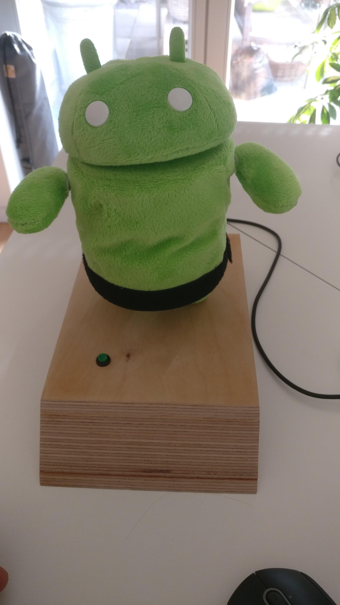

# Fluffy-Android-Jenkins-Raspberry-Pi-Pico
This is the code for my fluffy Android Jenkins Interface

## JavaFX-Test
JavaFX-Test contains a IntelliJ IDEA project for testing the USB2Serial Interface between PC and Raspberry PI Pico.

## MicroPython
MicroPython contains the MicroPython code for the Raspberry PI Pico. You can install it using Thonny (https://thonny.org/)

## JenkinsInterface
JenkinsInterface contains the java application to start a jenkins job by pressing the button and show reaction if jenkins build is SUCCESS or not ....

## Picture

## Hardware

The hardware is just a small 4$ Raspberry PI Pico, 1 button and 3 small servos for rotating the head and the arms.
The Button is connected to GPIO 16 and GND
The Servos are connected to GPIO 13,14 and 15, 5V USB power and GND
